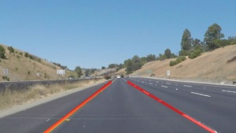

# **Finding Lane Lines on the Road**
Finding lane lines on the road with help of algorithmic edge detectors

Practical project to recognize road marking from images and video streams and highlight (annotate) left and right edges of the road lane. Algorithm is based on Canny edge detector and Hough line segments detector algorithms, provided by OpenCV library. More details are [here](./writeup.md).

**Project content**
*	[LaneLinesDetection.ipynb](./LaneLinesDetection.ipynb) – Jupyter IPython notebook with code and results of it running.
*	[LaneLinesDetection_output.html](./LaneLinesDetection_output.html) – the same Jupyter IPython notebook exported in HTML format
*	[writeup.md](./writeup.md) – project description in details
*	[test_images](./test_images) – folder with test source images
*	[test_images_output](./test_images_output) - folder with annotated images, workbook output
*	[test_images_annotated](./test_images_annotated) – folder with images annotated by advanced Probabilistic detector
*	[test_images_ext](./test_images_ext) – folder with images annotated by advanced Probabilistic detector and some external information
*	[test_videos](./test_videos) - folder with test video files
*	[test_videos_output](./test_videos_output) - folder with annotated video files, workbook output
*	[test_videos_annotated](./test_videos_annotated) - folder with video files annotated by advanced Probabilistic detector
