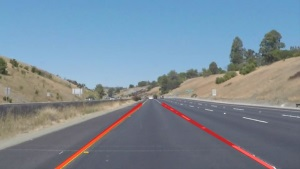
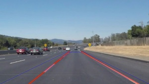

# **Finding Lane Lines on the Road**

Detection and annotation of road lane lines from images or video streams.

**Finding Lane Lines on the Road**

The goals / steps of this project are the following:
* Make a pipeline that finds lane lines on the road
* Reflect on your work in a written report



---

### Reflection

### 1. Describe your pipeline

During development of my pipeline I pursued next goals:
*	Cover all test files by same algorithm without parameters adjustment, but NOT fit it to the expected results
*	Do algorithm independent from input images size and source type (images/video)
*	Do all parameter external to make possible adjust it in one place
*	In case source type is video – do detection more smooth and use historical information from previous frames
*	Main annotations must be exactly what was requested in requirements – pair of extrapolated averaged lines – one for left lane line and one for right

For simplicity, pipeline was designed as a single method, with some parts moved in sub-methods, some just separated by user-friendly comments.

**Method declaration**

```
process_image_v1(
    image,
    draw_siggestions = False,
    horizontal_filter = True,
    probabilistic_detector = True,
    average_matrix_size = 0,
    average_matrix = [],
    average_theta_dif = 3 * np.pi / 180,
    average_max_dist = 15,
    direction_line_thickness = 10,
    direction_line_color = (255, 0, 0),
    direction_line_weight = 0.6,
    region_top_rel_pos = ((5.0 ** 0.5) - 1.0) / 2.0,
    region_top_rel_width = 0.11,
    region_top_rel_shift = 0.01,
    blur_kernel_size = 5,
    blur_kernel_size_prob_detector = 3,
    canny_low_threshold = 50,
    canny_high_threshold = 150,
    hough_rho = 2,
    hough_theta = np.pi/180,
    hough_threshold = 25,
    hough_min_line_length = 40,
    hough_max_line_gap = 25,
    additional_contrast = False,
    additional_sobel_v_filter = False,
    additional_gaussian_before = False,
    additional_gaussian_after = False,
    additional_use_polyfit_segments = True)
```
**Parameters**
*	*image* – source image
*	*draw_siggestions* – draw additional annotations (over half-transparent main annotations)
*	*horizontal_filter* – apply horizontal filter for line segments
*	*probabilistic_detector* – use advanced Probabilistic detector
*	*average_matrix_size* – average matrix size (for video streams)
*	*average_matrix* – average matrix (for video streams)
*	*average_theta_dif* – maximal allowed angle between line segments in one group
*	*average_max_dist* –  maximal allowed distance between line segments in one group
*	*direction_line_thickness* – main annotation line thickness
*	*direction_line_color* – main annotation line color
*	*direction_line_weight* – main annotation line transparence (0 = absolutely transparent, 1 = no transparency)
*	*region_top_rel_pos* – related vertical position of top part of region-of-interest
*	*region_top_rel_width* – related width of top part of region-of-interest
*	*region_top_rel_shift* – related shift from center of top part of region-of-interest
*	*blur_kernel_size* – kernel size of Gaussian blurring filter
*	*blur_kernel_size_prob_detector* – kernel size of Gaussian blurring filter (in case Probabilistic detector is used)
*	*canny_low_threshold* - Canny low threshold
*	*canny_high_threshold* - Canny high threshold
*	*hough_rho* – Hough Rho size
*	*hough_theta* - Hough Theta size
*	*hough_threshold* - Hough threshold
*	*hough_min_line_length* - Hough minimal line length
*	*hough_max_line_gap* - Hough maximal gap size
*	*additional_contrast* – add more contrast by linear contrast filter
*	*additional_sobel_v_filter* – use left and right Sobel filters as initial edge detector
*	*additional_gaussian_before* – run Gaussian filter before Sobel operator
*	*additional_gaussian_after* – run Gaussian filter after Sobel operator
*	*additional_use_polyfit_segments* – use OpenCV polyfit function to combine line segments in one average line
*	*_result_image* – method returns an annotated version of inbound image with same shape

**Pipeline**
*	Receive image from front camera installed on vehicle. Validate that its depth equals 3 – so it’s RGB image. If not, just return original image.
*	Convert RGB image to grayscale image with help of OpenCV *cvtColor()* function
*	Optionally add contrast with help of OpenCV linear filter with parameters:
```
filter2D(gray, -1, np.array([[-1.0/9, -1.0/9, -1.0/9], [-1.0/9, 2.0 - 1.0/9, -1.0/9], [-1.0/9, -1.0/9, -1.0/9]]))
```
As was discovered, this function adds more details, but it adds a bit more noise as well. It was switched off for final solution. But in wider context and with more precise parameters, function can be useful.
*	Optionally run Gaussian blurring filter with help of OpenCV *GaussianBlur()* function. It can be executed before and after optional Sobel operator. But for final solution it was switched off, because it removes more details than necessary. Canny edge detector run blurring internally, so double blurring is excessive.
*	Optionally run combined left and right Sobel filter with help of OpenCV function:
```
gray1 = cv2.filter2D(gray, -1, np.array([[-1.0, 0, 1.0], [-2.0, 0, 2.0], [-1.0, 0, 1.0]]))
gray2 = cv2.filter2D(gray, -1, np.array([[1.0, 0, -1.0], [2.0, 0, -2.0], [1.0, 0, -1.0]]))
gray = cv2.max(gray1, gray2)
```
Vertical Sobel filters can highlight vertical edges only and remove unnecessary horizontal lines. But it adds more noise as well. Probably makes sense play with parameters, but it was switched off for final solution.
*	Run Canny edge detector with help of OpenCV *Canny()* function.
*	Filter side planes with help of shape filter. It’s trapezium, built based on relative parameters and with shape as on image (see blue trapezium).<br>
<br>
Only data inside of selected region will be considered by further algorithm.
*	Run Hough line advanced detector to find edge line segments on image, including weak edges (combination of smaller line segments with gaps). Use OpenCV *HoughLinesP()* function for this purpose.
* Calculate parameters of horizontal filter. Horizontal filter is applied on set of line segments and filter line segments with incline angle out of calculate angles range. Main purpose of this filter – remove noise from side shades which usually represented by horizontal edges. Range of allowed angles is calculated based on image shape, because images can have different horizontal-to-vertical ratio. So parametrized filter is more robust. The other type of filtered out line segments – are segments which cross vertical center of trapezium.
*	Next part of algorithm depends on parameters. It’s possible either run Simple detector or Probabilistic detector.
*	**Simple detector** – actually, draw all line segments detected by Hough algorithm and filtered by horizontal filter. Many lines can overlap. So result is set of lane line segments without any extrapolation and additional processing. It’s used for demonstration purpose in first part of workbook. It shows how algorithm was developed from Simple detector to more advanced Probabilistic detector.
*	**Probabilistic detector** – it’s advanced algorithm, which try to find group of lane segments with most probability be part of left or right extrapolated lane line. This is most significant part of code, but it makes line detection more stable from frame to frame. Main assumption, that line cannot be moved in unexpected direction rapidly. In real-life solution, this algorithm must be driven by motion model with sensors feedback (like steering wheel rotation, speed changes, etc), but sure it’s out of this project scope. In more details this algorithm will be described separately.
*	And final steps – draw extrapolated and averaged lines on initial image. I used Open CV *addWeighted()* function for this purpose, but not directly. In case I apply it to original image with some weighting parameters, original image will be not so bright as initially was. The trick is – do this transformation on temporary image, cut only annotated part and insert it in original image. Image remains almost the same, only half-transparent lines are added.
* Optionally, based on *draw_siggestions* parameter, algorithm can additionally draw: trapezium, lines segments detected by Hough algorithm and extrapolated, but not averaged across frames.

**Probabilistic detector**
*	This algorithm takes as input the result of Hough line detector and array of extrapolated lines from previous frames.
*	Next step – group line segments by it incline angle and distance. Incline angle – is simple line Theta and it cannot be significantly different in one group (based on parameters). One lane line can be represented by several segments some from one side of line, some from other, but all must be almost parallel (line is too thin for perspective effect play significant role here).
*	The next part of grouping algorithm is distance measurement. Parallel lines can be located on significant distance or too close one to other. In some cases it will be part of same lane line, in some not. No any sense measure distance between points of different segments or compare Rho parameters. More reasonable measure of distance between two line segments is maximal distance of both ends of one segment to extrapolated line which contains another segment. Line-to-point distance is really good measurement to group segments which can be part of one solid line. Such segments can be on significant distance one from other, just because lane marking can have gaps. But algorithm correctly combines it together as well as segments located close one to other.
*	When lines are grouped, each group is weighted. Weight equals sum of squared lengths of line segments divided by normalized distance to average extrapolated lines detected from previous stream frames. Second part is applicable for streams only, for static images it has no any effect. More lines – higher weights, longer lines are preferable, close to previous frames is better (allow avoid rapid jumps caused by noise).
*	Two groups with maximal weights are selected – one for left line and one for right.
*	To combine average and extrapolate lines from line segments two alternative algorithms can be used. First just use OpenCV *polyfit()* function – based on line segments only. Second – is custom algorithm: calculate average Theta (in each group it can be just slightly different), move imaginary line through each line segment end in group, take maximal and minimal value of Rho and just find median for these 2 values. After some testing was not detected significant difference between both algorithms on test samples, so standard OpenCV is used by default.
*	Next set of steps – cross-frames optimization and averaging. Detected pair of lines from previous step is added to set of lines detected from previous frames. After that this array is filtered to remove rapid jumps – in case 1st and 3rd frame have similar line position and incline angle, but 2nd is different, this example is removed and not affect averaging process anymore. Last added value can be spurious as well, but it cannot be just removed. In case this value is significantly different from average, it's excluded from averaging, but not removed. Remain lines are averaged with help of OpenCV polyfit() function. As result lane line annotation move as smooth as possible. It's controlled by parameter which in real-life solution must depend on frame ratio and vehicle speed.

**How to use**
*	For static images processing just call:
```
process_image_v1(image)
```
Additionally, default parameters can be changed.
*	For stream processing:
Declare globally before whole stream processing
```
global avg_matrix_global
avg_matrix_global = []
```
For each image in stream call:
```
process_image_v1(
    image,
    average_matrix_size = 12,
    average_matrix = avg_matrix_global)
```
*average_matrix_size* must depends on frame rate and actual vehicle speed. Additionally, default parameters can be changed.

**Output**
Outputs from workbook partially use Simple detector, partially Probabilistic. As result outputs are mixed. I added some more outputs mostly to be possible compare results of Probabilistic detector on different samples.
* *test_images_output* - output from workbooks - test images processed by Simple detector.
* *test_images_annotated* - test images processed by Probabilistic detector.
* *test_images_ext* - test images processed by Probabilistic detector with added filtered Hough line segments (light-blue).
* *test_videos_output* - output from workbooks - test videos processed partially by Simple and Probabilistic detector.
* *test_videos_annotated* - test videos processed by Probabilistic detector.


### 2. Identify potential shortcomings with your current pipeline

This algorithm is designed more for demonstration purpose, so have set of shortcomings. I just describe several:
*	*Contrast changes* – depends on lighting conditions lane lines can have different contrast in comparison to road coverage and side shades. It play role in gradient calculations. To avoid this image lighting conditions must be estimated first and image must be pre-processed.
*	*Scene perspective changes* – real roads have variable incline levels which change significantly perspective and region of interest. Background sidewalk, landscape, grass and other nature can accidentally appear in region of interest and add much noise in lane line detection. And sure other cars, pedestrians and other barriers can appear in region of interest. To avoid this, good background filter must be used. But better solution must be based on depth measurements with help of LiDAR and image recognition.
*	*No feedback from vehicle sensor* – car can bounce, change steering angle, change speed and so on. All these can rapidly, but partially predictable, change position of car accordingly to road and need feedback from different sensors to correct region of interest and expected incline of lane line accordingly to car behavior and position on the road.
*	*Road lane lines curvature is not analyzed* – when road have some bends, the shape of road marking will be significantly different from straight line. Sure, it’s more complex situation in this case car must more rely on depth sensors, path planning and road maps. But lane line detector can be good additional suggestion for more precise positioning of the car.
*	*No visible road marking* - in some cases lane lines are not exist on the road at all or can be invisible, for instance, covered by snow. And algorithm must understand it, instead of take data from some noise. In this case comparison of several lane detection algorithms can be useful approach. For example, edge detection with different parameters can be used - use support or decline hypothesis of other. Vertical Sobel operator followed by Canny can be used in comparison with simple Canny for this purpose.

### 3. Suggest possible improvements to your pipeline

Shortcomings descriptions are logically followed by suggested improvements, so just a list will be provided:
*	Add image pre-processing to do it more smooth or contrast depends on scene lighting conditions.
*	Region of interest must include road only and exclude all other objects. Use different sensors and image recognition.
*	Drive detection algorithm by motion model and adjust parameters depends on external sensors feedback (steering wheel angle, car speed and acceleration, gyro-sensors, etc.)
*	Make possible to detect not only straight lines, but any marking curvature.
*	Make possible to detect when marking is absent or invisible.
*	Use C/C++, GPU to speedup calculations.
